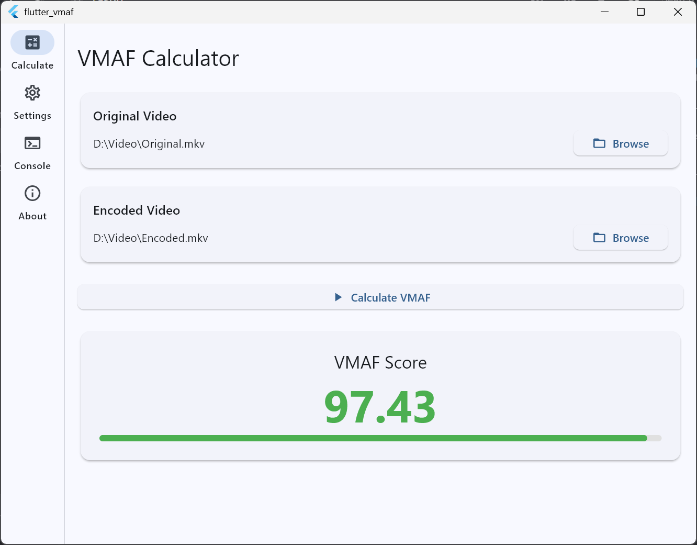
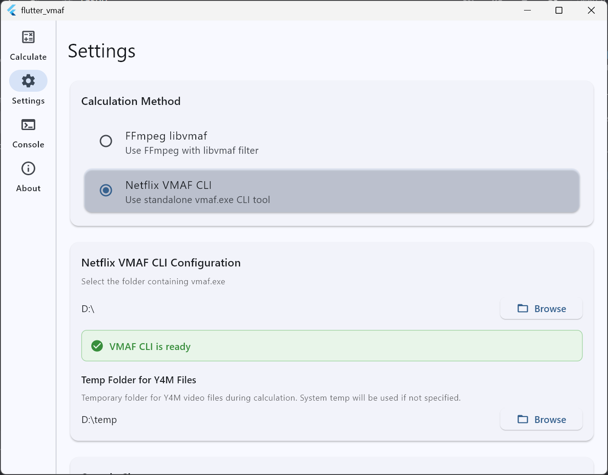

# Flutter VMAF

A Windows desktop application for calculating VMAF (Video Multimethod Assessment Fusion) video quality scores using FFmpeg with libvmaf filter or Netflix VMAF CLI.




## What is VMAF?

VMAF is an objective video quality metric developed by Netflix that predicts human perception of video quality. It compares a distorted (encoded) video against a reference (original) video and produces a score from 0-100.

## Features

- Calculate VMAF scores between two video files
- **Two calculation methods**: FFmpeg libvmaf or Netflix VMAF CLI
- Real-time progress tracking during calculation
- Console tab with real-time logging
- Set custom FFmpeg path in Settings
- **Netflix VMAF CLI support** - use standalone `vmaf.exe` with temp folder configuration
- Cancel ongoing calculations
- Clean Architecture with flutter_bloc state management
- **Logging to file** (`log.txt` next to executable)

## Prerequisites

1. **Flutter SDK** (3.x) - [Install Flutter for Windows](https://docs.flutter.dev/get-started/install/windows)
2. **FFmpeg** (Required for FFmpeg libvmaf method)
   - Download from: https://ffmpeg.org/download.html
   - Requires both `ffmpeg.exe` and `ffprobe.exe`
   - Set path in Settings → Select "FFmpeg libvmaf" method
3. **Netflix VMAF CLI** (Optional) - For alternative calculation method
   - Build from source: https://github.com/Netflix/vmaf
   - Requires `vmaf.exe` executable
   - Set path in Settings → Select "Netflix VMAF CLI" method

## Setup

1. Clone the repository:
   ```
   git clone <repository-url>
   cd flutter-vmaf/flutter_vmaf
   ```

2. Install dependencies:
   ```
   flutter pub get
   ```

3. Run the app in development mode:
   ```
   flutter run -d windows
   ```

## Building

To build a release executable:

```
flutter build windows --release
```

The executable will be created at:
```
build\windows\x64\runner\Release\flutter_vmaf.exe
```

## Usage

1. Launch the app
2. Go to **Settings** tab:
   - Select calculation method: **FFmpeg libvmaf** or **Netflix VMAF CLI**
   - For FFmpeg: Set FFmpeg path (folder containing `ffmpeg.exe` and `ffprobe.exe`)
   - For Netflix CLI: Set path to folder containing `vmaf.exe`
   - **Optional**: Set custom temp folder for Y4M files (or leave empty for system temp)
3. Go to **Calculate** tab:
   - Select the **Original** (reference) video file
   - Select the **Encoded** (distorted) video file
   - Click **Calculate VMAF**
4. View the result score in the UI

### Score Interpretation

- **80-100**: Excellent quality (green)
- **60-79**: Fair quality (orange)
- **0-59**: Poor quality (red)

## Architecture

This project follows Clean Architecture principles with feature-first organization:

- **Presentation Layer**: Pages, Widgets, BLoCs
- **Domain Layer**: Entities, Use Cases, Repository Interfaces
- **Data Layer**: Repository Implementations, Data Sources, Models

### Key Dependencies

- `flutter_bloc` - State management
- `dartz` - Functional programming (Either for error handling)
- `get_it` - Dependency injection
- `file_picker` - File selection dialogs
- `path_provider` - File system access

## Netflix VMAF CLI Integration

The app supports two calculation methods:

### 1. FFmpeg libvmaf (Default)
- Uses FFmpeg's built-in libvmaf filter
- Faster setup (just need FFmpeg)
- Progress: Shows frame conversion and VMAF calculation progress

### 2. Netflix VMAF CLI
- Uses standalone `vmaf.exe` from Netflix VMAF repository
- **Requires**: `vmaf.exe` + FFmpeg (for Y4M conversion)
- **Features**:
  - `--threads 0` for multi-threaded processing
  - `--json` output for reliable score parsing
  - Custom temp folder for Y4M files during conversion
- **Setup**:
  1. Build Netflix VMAF from source: https://github.com/Netflix/vmaf
  2. In Settings: Select "Netflix VMAF CLI"
  3. Browse to folder containing `vmaf.exe`
  4. (Optional) Set temp folder for Y4M files

## Logging

The app logs to `log.txt` located next to the executable:
```
build\windows\x64\runner\Debug\log.txt
```

To view logs, check this file after running the app.

## Settings

### FFmpeg Configuration
- Set path to folder containing `ffmpeg.exe` and `ffprobe.exe`
- Validation: Checks if executables exist and shows version

### Netflix VMAF CLI Configuration
- Select calculation method: "Netflix VMAF CLI"
- Set path to folder containing `vmaf.exe`
- Validation: Runs `vmaf.exe --version` to detect version
- **Temp Folder for Y4M Files**:
  - Optional custom folder for temporary Y4M conversion files
  - Leave empty to use system temp directory
  - Files are automatically cleaned up after calculation

## License

This project uses the following open source packages (see pubspec.yaml for full list):
- flutter_bloc: BSD-3-Clause
- Freezed: MIT
- dartz: MIT
- GetIt: MIT
- File Picker: MIT

### FFmpeg Licensing

FFmpeg is licensed under LGPL/GPL. The libvmaf filter is licensed under BSD-3-Clause. When distributing this application, consider the licensing implications of bundling FFmpeg. See https://ffmpeg.org/legal.html for details.

### Netflix VMAF License

Netflix VMAF is licensed under BSD-3-Clause. See https://github.com/Netflix/vmaf/blob/master/LICENSE for details.
